# Robot Commando Block Graph

- Generated from `RobotCommando/BookData/Blocks/*.xml`.
- Edge labels prefixed with `[hidden]`, `[inferred]`, or `[unknown]` were reconstructed from prose, item references, or OCR gaps.
- Victory endings are block `140` (awakens Thalos), block `354` (defeats Minos in the Supertank), and block `355` (wins the duel with Minos).
- SCC splitting is not very helpful here: the block graph has one giant strongly connected component with 205 nodes, so this file is split by location instead.
- Colors: Farm teal, Current indigo, Capital red, Knowledge purple, Industry green, Guardians mint, Jungle gold, Storms blue, Worship violet, Pleasure pink, Inherit gray, Unknown pale yellow.

## Overview

- Cross-location transitions only. Use the per-location graphs below for block-level detail.

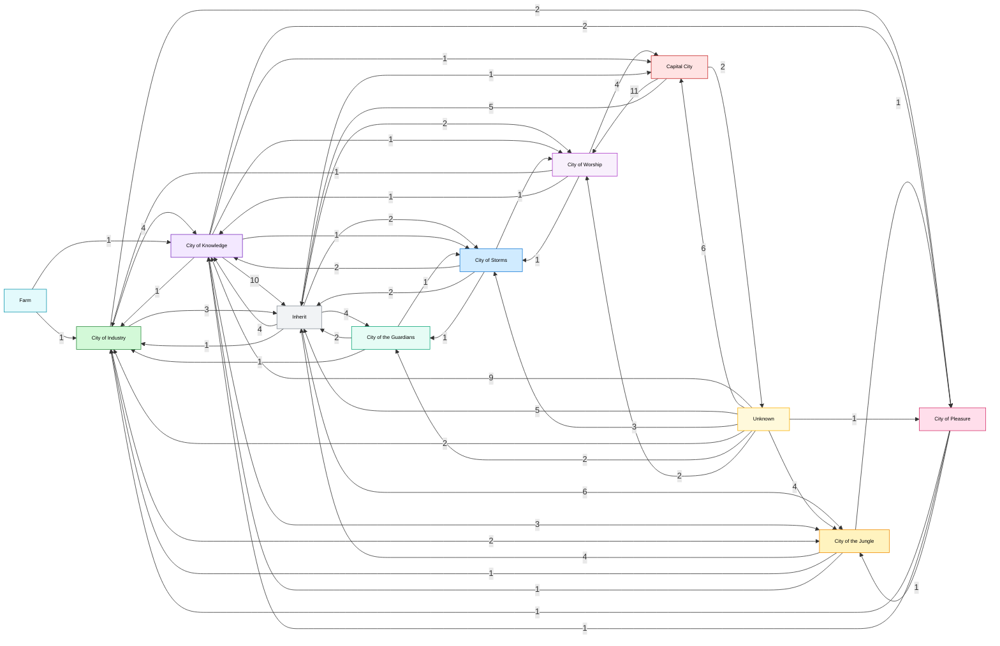

## Farm

- Blocks: 5. Internal edges: 7. External edges: 2. Unresolved edges: 0.
- Exits to: City of Industry (1), City of Knowledge (1).

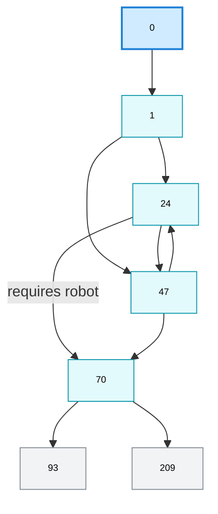

## Capital City

- Blocks: 96. Internal edges: 126. External edges: 18. Unresolved edges: 1.
- Exits to: City of Worship (11), Inherit (5), Unknown (2).

```mermaid
flowchart TD
    classDef start fill:#d0ebff,stroke:#1c7ed6,stroke-width:2px,color:#000;
    classDef victory fill:#d8f5d0,stroke:#2b8a3e,stroke-width:3px,color:#000;
    classDef ending fill:#ffe3e3,stroke:#c92a2a,stroke-width:2px,color:#000;
    classDef unknown fill:#fff3bf,stroke:#f08c00,stroke-width:2px,color:#000;
    classDef external fill:#f1f3f5,stroke:#868e96,color:#000,font-size:10px;
    classDef loc_Farm fill:#e3fafc,stroke:#1098ad,color:#000,font-size:10px;
    classDef loc_Current fill:#edf2ff,stroke:#4263eb,color:#000,font-size:10px;
    classDef loc_Capital_City fill:#ffe3e3,stroke:#c92a2a,color:#000,font-size:10px;
    classDef loc_City_of_Knowledge fill:#f3e8ff,stroke:#7b2cbf,color:#000,font-size:10px;
    classDef loc_City_of_Industry fill:#d3f9d8,stroke:#2b8a3e,color:#000,font-size:10px;
    classDef loc_City_of_the_Guardians fill:#e6fcf5,stroke:#0ca678,color:#000,font-size:10px;
    classDef loc_City_of_the_Jungle fill:#fff3bf,stroke:#f08c00,color:#000,font-size:10px;
    classDef loc_City_of_Storms fill:#d0ebff,stroke:#1c7ed6,color:#000,font-size:10px;
    classDef loc_City_of_Worship fill:#f8f0fc,stroke:#ae3ec9,color:#000,font-size:10px;
    classDef loc_City_of_Pleasure fill:#ffdeeb,stroke:#d6336c,color:#000,font-size:10px;
    classDef loc_Inherit fill:#f1f3f5,stroke:#868e96,color:#000,font-size:10px;
    classDef loc_Unknown fill:#fff9db,stroke:#fab005,color:#000,font-size:10px;

    b0004["4"]
    b0006["6"]
    b0010["10"]
    b0011["11"]
    b0012["12"]
    b0018["18"]
    b0027["27"]
    b0029["29"]
    b0031["31"]
    b0032["32"]
    b0037["37"]
    b0042["42"]
    b0050["50"]
    b0055["55"]
    b0057["57"]
    b0071["71"]
    b0074["74"]
    b0075["75"]
    b0076["76"]
    b0086["86"]
    b0090["90"]
    b0092["92"]
    b0098["98"]
    b0103["103"]
    b0106["106"]
    b0107["107"]
    b0108["108"]
    b0111["111"]
    b0120["120"]
    b0123["123"]
    b0125["125"]
    b0134["134"]
    b0145["145"]
    b0149["149"]
    b0153["153"]
    b0156["156"]
    b0158["158"]
    b0164["164"]
    b0173["173"]
    b0176["176"]
    b0187["187"]
    b0190["190"]
    b0192["192"]
    b0193["193"]
    b0194["194"]
    b0201["201"]
    b0204["204"]
    b0205["205"]
    b0214["214"]
    b0215["215"]
    b0216["216"]
    b0219["219"]
    b0222["222"]
    b0226["226"]
    b0228["228"]
    b0242["242"]
    b0243["243"]
    b0245["245"]
    b0249["249"]
    b0253["253"]
    b0261["261"]
    b0264["264"]
    b0266["266"]
    b0267["267"]
    b0275["275"]
    b0283["283"]
    b0286["286"]
    b0290["290"]
    b0296["296"]
    b0297["297"]
    b0301["301"]
    b0303["303"]
    b0304["304"]
    b0308["308"]
    b0311["311"]
    b0314["314"]
    b0323["323"]
    b0325["325"]
    b0326["326"]
    b0327["327"]
    b0330["330"]
    b0334["334"]
    b0339["339"]
    b0343["343"]
    b0352["352"]
    b0353["353"]
    b0354["354"]
    b0355["355"]
    b0358["358"]
    b0365["365"]
    b0375["375"]
    b0377["377"]
    b0384["384"]
    b0386["386"]
    b0388["388"]
    b0395["395"]
    e0007["7"]
    e0021["21"]
    e0030["30"]
    e0061["61"]
    e0166["166"]
    e0279["279"]
    e0316["316"]
    e0390["390"]
    unknown["?"]

    b0004 --> b0018
    b0004 --> b0032
    b0010 --> b0042
    b0010 --> b0071
    b0011 --> b0308
    b0018 --> b0055
    b0018 --> b0187
    b0029 -->|win| b0275
    b0029 --> b0308
    b0029 --> b0384
    b0031 --> b0055
    b0031 --> b0153
    b0031 --> b0290
    b0032 --> b0090
    b0032 --> b0103
    b0042 -->|inferred direct prose turn| b0071
    b0050 --> b0249
    b0050 --> b0304
    b0050 --> b0339
    b0050 --> b0365
    b0055 --> b0075
    b0055 -->|escape| b0098
    b0055 --> b0125
    b0057 --> b0193
    b0071 -->|inferred direct prose turn| b0106
    b0071 --> b0134
    b0074 --> b0219
    b0074 --> b0395
    b0075 --> b0098
    b0075 --> b0245
    b0076 --> b0120
    b0076 --> b0145
    b0076 --> b0264
    b0090 --> b0103
    b0090 --> b0201
    b0098 --> b0032
    b0098 --> b0187
    b0103 -->|hidden know duel-customs ref 111| b0111
    b0103 -->|otherwise| b0228
    b0106 --> b0164
    b0106 --> b0190
    b0106 --> b0215
    b0108 -->|win| b0290
    b0111 --> b0173
    b0111 --> b0253
    b0111 --> b0267
    b0111 --> b0283
    b0120 -->|inferred direct prose turn| b0027
    b0123 -->|lucky| b0086
    b0123 --> b0204
    b0125 -->|lucky| b0176
    b0134 -->|If you have an enemy...| b0243
    b0134 --> b0266
    b0145 --> b0027
    b0153 --> b0108
    b0153 --> b0290
    b0153 --> b0311
    b0156 --> b0006
    b0156 -->|win| b0354
    b0158 --> b0214
    b0158 --> b0242
    b0164 -->|inferred direct prose turn| b0308
    b0176 --> b0205
    b0176 --> b0226
    b0187 -->|otherwise| b0050
    b0190 --> b0215
    b0190 --> b0296
    b0192 --> b0029
    b0192 --> b0074
    b0193 --> b0327
    b0194 --> b0308
    b0205 -->|hidden know duel-customs ref 111| b0111
    b0205 -->|otherwise| b0228
    b0214 --> b0297
    b0214 -->|lucky| b0314
    b0215 --> b0296
    b0215 --> b0334
    b0216 -->|inferred direct prose turn| b0308
    b0219 --> b0011
    b0219 --> b0303
    b0222 --> b0032
    b0222 --> b0076
    b0228 --> b0267
    b0228 --> b0283
    b0242 -->|inferred direct prose turn| b0330
    b0243 -->|inferred direct prose turn| b0308
    b0249 --> b0123
    b0253 -->|inferred direct prose turn| b0158
    b0261 --> b0057
    b0264 -->|inferred direct prose turn| b0027
    b0266 -->|inferred direct prose turn| b0308
    b0275 -->|hidden use the Tangler Field| b0301
    b0275 -->|If you have the Tangl...| b0326
    b0286 --> b0352
    b0290 --> b0216
    b0290 --> b0343
    b0296 -->|inferred direct prose turn| b0358
    b0301 -->|inferred direct prose turn| b0156
    b0303 --> b0323
    b0303 --> b0353
    b0303 --> b0375
    b0304 --> b0057
    b0304 --> b0261
    b0311 --> b0108
    b0311 -->|lucky| b0325
    b0314 --> b0377
    b0323 --> b0308
    b0323 --> b0395
    b0325 -->|inferred direct prose turn| b0290
    b0330 --> b0355
    b0334 -->|inferred direct prose turn| b0358
    b0339 --> b0149
    b0339 --> b0286
    b0343 --> b0216
    b0343 --> b0386
    b0358 -->|inferred direct prose turn| b0308
    b0365 --> b0037
    b0365 --> b0107
    b0375 -->|inferred direct prose turn| b0308
    b0377 --> b0330
    b0377 --> b0388
    b0386 --> b0092
    b0386 --> b0194
    b0386 -->|escape| b0216
    b0388 -->|inferred direct prose turn| b0330
    b0395 -->|inferred direct prose turn| b0308
    b0012 -->|2d6 > Skill| e0279
    b0012 -->|2d6 <= Skill| e0316
    b0057 --> e0166
    b0086 --> e0166
    b0098 --> e0030
    b0107 -->|inferred direct prose turn| e0166
    b0108 --> e0061
    b0149 -->|inferred direct prose turn| e0166
    b0187 -->|hidden know countersign 'Seven'| e0007
    b0193 --> e0166
    b0204 -->|inferred direct prose turn| e0166
    b0249 --> e0166
    b0261 --> e0166
    b0286 -->|escape| e0021
    b0327 --> e0166
    b0352 -->|inferred direct prose turn| e0166
    b0365 --> e0390
    b0386 --> e0061
    b0092 -->|unknown return after defeating the Construction Robot| unknown

    class b0004,b0006,b0010,b0011,b0012,b0018,b0027,b0029,b0031,b0032,b0037,b0042,b0050,b0055,b0057,b0071,b0074,b0075,b0076,b0086,b0090,b0092,b0098,b0103,b0106,b0107,b0108,b0111,b0120,b0123,b0125,b0134,b0145,b0149,b0153,b0156,b0158,b0164,b0173,b0176,b0187,b0190,b0192,b0193,b0194,b0201,b0204,b0205,b0214,b0215,b0216,b0219,b0222,b0226,b0228,b0242,b0243,b0245,b0249,b0253,b0261,b0264,b0266,b0267,b0275,b0283,b0286,b0290,b0296,b0297,b0301,b0303,b0304,b0308,b0311,b0314,b0323,b0325,b0326,b0327,b0330,b0334,b0339,b0343,b0352,b0353,b0354,b0355,b0358,b0365,b0375,b0377,b0384,b0386,b0388,b0395 loc_Capital_City;
    class e0007,e0021,e0030,e0061,e0166,e0279,e0316,e0390 external;
    class b0354,b0355 victory;
    class b0006,b0037,b0173,b0201,b0226,b0267,b0297,b0326 ending;
    class unknown unknown;
```

## City of Knowledge

- Blocks: 96. Internal edges: 170. External edges: 19. Unresolved edges: 1.
- Exits to: Inherit (10), City of the Jungle (3), City of Pleasure (2), Capital City (1), City of Industry (1), City of Storms (1), City of Worship (1).

```mermaid
flowchart TD
    classDef start fill:#d0ebff,stroke:#1c7ed6,stroke-width:2px,color:#000;
    classDef victory fill:#d8f5d0,stroke:#2b8a3e,stroke-width:3px,color:#000;
    classDef ending fill:#ffe3e3,stroke:#c92a2a,stroke-width:2px,color:#000;
    classDef unknown fill:#fff3bf,stroke:#f08c00,stroke-width:2px,color:#000;
    classDef external fill:#f1f3f5,stroke:#868e96,color:#000,font-size:10px;
    classDef loc_Farm fill:#e3fafc,stroke:#1098ad,color:#000,font-size:10px;
    classDef loc_Current fill:#edf2ff,stroke:#4263eb,color:#000,font-size:10px;
    classDef loc_Capital_City fill:#ffe3e3,stroke:#c92a2a,color:#000,font-size:10px;
    classDef loc_City_of_Knowledge fill:#f3e8ff,stroke:#7b2cbf,color:#000,font-size:10px;
    classDef loc_City_of_Industry fill:#d3f9d8,stroke:#2b8a3e,color:#000,font-size:10px;
    classDef loc_City_of_the_Guardians fill:#e6fcf5,stroke:#0ca678,color:#000,font-size:10px;
    classDef loc_City_of_the_Jungle fill:#fff3bf,stroke:#f08c00,color:#000,font-size:10px;
    classDef loc_City_of_Storms fill:#d0ebff,stroke:#1c7ed6,color:#000,font-size:10px;
    classDef loc_City_of_Worship fill:#f8f0fc,stroke:#ae3ec9,color:#000,font-size:10px;
    classDef loc_City_of_Pleasure fill:#ffdeeb,stroke:#d6336c,color:#000,font-size:10px;
    classDef loc_Inherit fill:#f1f3f5,stroke:#868e96,color:#000,font-size:10px;
    classDef loc_Unknown fill:#fff9db,stroke:#fab005,color:#000,font-size:10px;

    b0003["3"]
    b0009["9"]
    b0013["13"]
    b0014["14"]
    b0017["17"]
    b0026["26"]
    b0036["36"]
    b0038["38"]
    b0040["40"]
    b0046["46"]
    b0052["52"]
    b0053["53"]
    b0054["54"]
    b0058["58"]
    b0063["63"]
    b0065["65"]
    b0066["66"]
    b0077["77"]
    b0078["78"]
    b0080["80"]
    b0085["85"]
    b0087["87"]
    b0088["88"]
    b0091["91"]
    b0093["93"]
    b0096["96"]
    b0102["102"]
    b0104["104"]
    b0109["109"]
    b0112["112"]
    b0113["113"]
    b0116["116"]
    b0117["117"]
    b0124["124"]
    b0126["126"]
    b0129["129"]
    b0133["133"]
    b0136["136"]
    b0139["139"]
    b0146["146"]
    b0147["147"]
    b0148["148"]
    b0150["150"]
    b0155["155"]
    b0160["160"]
    b0161["161"]
    b0162["162"]
    b0168["168"]
    b0171["171"]
    b0177["177"]
    b0180["180"]
    b0184["184"]
    b0185["185"]
    b0186["186"]
    b0189["189"]
    b0199["199"]
    b0202["202"]
    b0207["207"]
    b0210["210"]
    b0212["212"]
    b0223["223"]
    b0224["224"]
    b0230["230"]
    b0231["231"]
    b0232["232"]
    b0252["252"]
    b0254["254"]
    b0255["255"]
    b0256["256"]
    b0268["268"]
    b0270["270"]
    b0276["276"]
    b0277["277"]
    b0289["289"]
    b0291["291"]
    b0300["300"]
    b0302["302"]
    b0305["305"]
    b0310["310"]
    b0313["313"]
    b0322["322"]
    b0328["328"]
    b0329["329"]
    b0332["332"]
    b0336["336"]
    b0345["345"]
    b0348["348"]
    b0361["361"]
    b0368["368"]
    b0372["372"]
    b0374["374"]
    b0380["380"]
    b0381["381"]
    b0383["383"]
    b0396["396"]
    b0399["399"]
    e0007["7"]
    e0030["30"]
    e0061["61"]
    e0132["132"]
    e0137["137"]
    e0165["165"]
    e0166["166"]
    e0179["179"]
    e0192["192"]
    e0265["265"]
    e0288["288"]
    e0293["293"]
    e0341["341"]
    e0350["350"]
    e0390["390"]
    e0394["394"]
    unknown["?"]

    b0003 --> b0147
    b0009 --> b0085
    b0009 --> b0129
    b0009 --> b0150
    b0013 --> b0361
    b0014 -->|first visit| b0036
    b0014 -->|first visit| b0058
    b0014 -->|first visit| b0080
    b0014 -->|first visit| b0102
    b0014 -->|revisit| b0160
    b0017 -->|have Cloak Model Reference| b0053
    b0017 -->|missing Cloak Model Reference| b0085
    b0026 --> b0113
    b0026 --> b0136
    b0036 --> b0014
    b0036 --> b0146
    b0038 --> b0313
    b0040 -->|hidden know password 88| b0088
    b0040 -->|no password| b0305
    b0046 --> b0078
    b0046 -->|If you roll 12.| b0109
    b0052 -->|inferred direct prose turn| b0063
    b0053 -->|inferred direct prose turn| b0085
    b0054 -->|first visit| b0077
    b0054 -->|first visit| b0126
    b0054 -->|revisit| b0232
    b0058 --> b0180
    b0058 --> b0224
    b0063 --> b0054
    b0063 --> b0066
    b0063 --> b0160
    b0063 --> b0277
    b0063 --> b0380
    b0065 --> b0256
    b0065 --> b0268
    b0065 --> b0300
    b0066 --> b0085
    b0066 --> b0129
    b0066 -->|inferred direct prose turn| b0150
    b0066 --> b0171
    b0066 -->|inferred direct prose turn| b0189
    b0077 --> b0126
    b0077 --> b0185
    b0077 --> b0210
    b0078 --> b0133
    b0080 --> b0014
    b0080 -->|inferred leave the museum| b0102
    b0085 --> b0017
    b0085 --> b0096
    b0085 --> b0129
    b0085 --> b0150
    b0085 --> b0171
    b0087 --> b0177
    b0087 --> b0199
    b0087 -->|unlucky| b0223
    b0088 --> b0063
    b0091 --> b0126
    b0091 --> b0210
    b0093 --> b0116
    b0093 --> b0186
    b0096 -->|inferred direct prose turn| b0085
    b0102 -->|1014 => 224| b0224
    b0104 --> b0372
    b0109 --> b0065
    b0109 --> b0155
    b0113 -->|inferred direct prose turn| b0063
    b0116 -->|If you have a flying...| b0139
    b0116 --> b0162
    b0117 --> b0270
    b0117 --> b0291
    b0117 --> b0310
    b0124 --> b0014
    b0124 --> b0124
    b0126 --> b0104
    b0126 --> b0210
    b0129 --> b0117
    b0129 --> b0252
    b0133 -->|inferred direct prose turn| b0289
    b0139 -->|inferred direct prose turn| b0013
    b0146 --> b0168
    b0146 --> b0202
    b0147 -->|inferred visit the Thalian Museum| b0014
    b0147 --> b0054
    b0147 --> b0066
    b0147 --> b0380
    b0148 -->|lucky| b0091
    b0148 --> b0161
    b0150 --> b0014
    b0150 --> b0054
    b0150 --> b0277
    b0150 --> b0380
    b0155 --> b0065
    b0160 --> b0063
    b0160 --> b0184
    b0161 -->|win| b0126
    b0161 --> b0210
    b0162 -->|inferred direct prose turn| b0013
    b0168 -->|inferred direct prose turn| b0014
    b0171 --> b0085
    b0171 --> b0129
    b0171 --> b0150
    b0171 --> b0212
    b0171 --> b0336
    b0177 -->|inferred direct prose turn| b0065
    b0180 --> b0224
    b0184 --> b0063
    b0184 --> b0207
    b0185 --> b0126
    b0185 --> b0148
    b0186 --> b0013
    b0186 --> b0361
    b0189 --> b0085
    b0189 --> b0129
    b0189 --> b0150
    b0189 --> b0171
    b0199 -->|inferred direct prose turn| b0065
    b0202 -->|inferred direct prose turn| b0168
    b0207 -->|escape| b0052
    b0207 --> b0230
    b0207 --> b0255
    b0210 --> b0014
    b0210 --> b0066
    b0210 --> b0277
    b0212 -->|inferred direct prose turn| b0009
    b0223 -->|inferred direct prose turn| b0078
    b0224 -->|1014 => 224| b0224
    b0224 --> b0374
    b0230 -->|inferred direct prose turn| b0063
    b0231 --> b0085
    b0231 --> b0129
    b0231 -->|inferred direct prose turn| b0150
    b0252 -->|inferred direct prose turn| b0150
    b0254 --> b0210
    b0254 --> b0276
    b0255 -->|inferred direct prose turn| b0063
    b0256 -->|inferred direct prose turn| b0368
    b0268 -->|inferred direct prose turn| b0368
    b0270 --> b0310
    b0276 --> b0046
    b0276 --> b0087
    b0276 --> b0147
    b0276 -->|If you have been here...| b0332
    b0289 --> b0345
    b0291 -->|inferred direct prose turn| b0189
    b0300 -->|inferred direct prose turn| b0368
    b0302 --> b0328
    b0305 -->|inferred direct prose turn| b0026
    b0310 -->|lucky| b0329
    b0310 --> b0348
    b0322 --> b0381
    b0322 --> b0399
    b0329 --> b0254
    b0332 -->|inferred direct prose turn| b0147
    b0361 -->|first visit| b0014
    b0361 -->|revisit| b0040
    b0361 -->|first visit| b0054
    b0361 -->|first visit| b0066
    b0361 -->|first visit| b0277
    b0361 -->|first visit| b0380
    b0368 --> b0322
    b0368 --> b0345
    b0372 --> b0302
    b0374 -->|1014 => 224| b0224
    b0381 -->|inferred direct prose turn| b0147
    b0383 -->|inferred direct prose turn| b0150
    b0396 --> b0054
    b0396 --> b0066
    b0396 --> b0277
    b0396 --> b0380
    b0399 -->|inferred direct prose turn| b0147
    b0038 -->|inferred direct prose turn| e0137
    b0088 --> e0132
    b0088 --> e0192
    b0104 --> e0394
    b0112 --> e0165
    b0112 --> e0288
    b0155 --> e0061
    b0171 --> e0030
    b0171 -->|escape| e0293
    b0210 --> e0390
    b0289 --> e0061
    b0302 --> e0350
    b0305 -->|hidden know countersign 'Seven'| e0007
    b0313 --> e0137
    b0313 --> e0341
    b0380 --> e0137
    b0380 --> e0166
    b0380 --> e0179
    b0380 --> e0265
    b0270 -->|unknown flee the jungle| unknown

    class b0003,b0009,b0013,b0014,b0017,b0026,b0036,b0038,b0040,b0046,b0052,b0053,b0054,b0058,b0063,b0065,b0066,b0077,b0078,b0080,b0085,b0087,b0088,b0091,b0093,b0096,b0102,b0104,b0109,b0112,b0113,b0116,b0117,b0124,b0126,b0129,b0133,b0136,b0139,b0146,b0147,b0148,b0150,b0155,b0160,b0161,b0162,b0168,b0171,b0177,b0180,b0184,b0185,b0186,b0189,b0199,b0202,b0207,b0210,b0212,b0223,b0224,b0230,b0231,b0232,b0252,b0254,b0255,b0256,b0268,b0270,b0276,b0277,b0289,b0291,b0300,b0302,b0305,b0310,b0313,b0322,b0328,b0329,b0332,b0336,b0345,b0348,b0361,b0368,b0372,b0374,b0380,b0381,b0383,b0396,b0399 loc_City_of_Knowledge;
    class e0007,e0030,e0061,e0132,e0137,e0165,e0166,e0179,e0192,e0265,e0288,e0293,e0341,e0350,e0390,e0394 external;
    class b0136,b0336 ending;
    class unknown unknown;
```

## City of Industry

- Blocks: 47. Internal edges: 79. External edges: 11. Unresolved edges: 1.
- Exits to: City of Knowledge (4), Inherit (3), City of Pleasure (2), City of the Jungle (2).

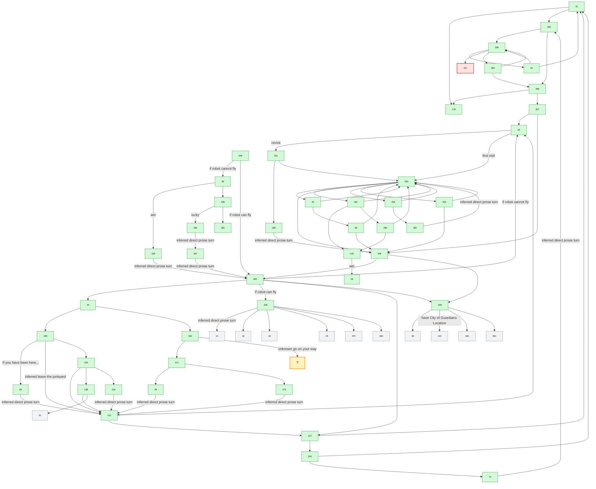

## City of the Guardians

- Blocks: 6. Internal edges: 5. External edges: 4. Unresolved edges: 0.
- Exits to: Inherit (2), City of Industry (1), City of Storms (1).

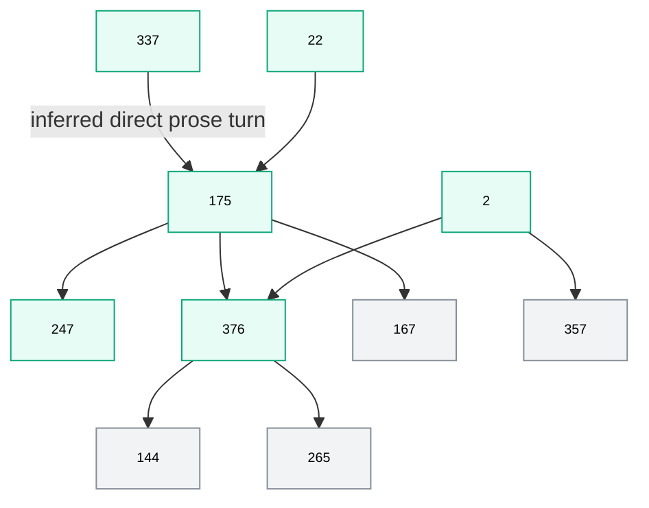

## City of the Jungle

- Blocks: 27. Internal edges: 41. External edges: 7. Unresolved edges: 1.
- Exits to: Inherit (4), City of Industry (1), City of Knowledge (1), City of Pleasure (1).

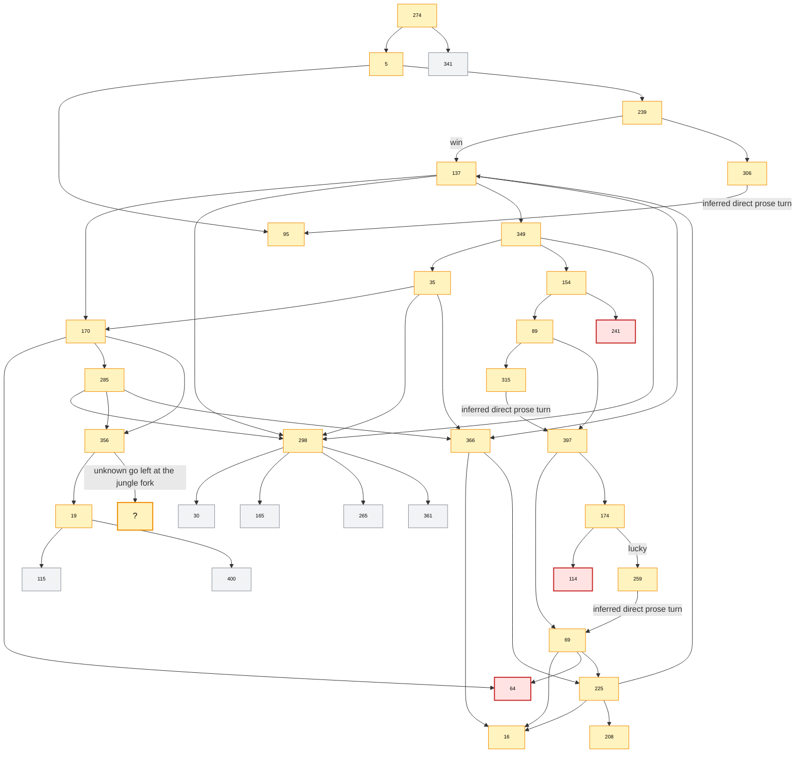

## City of Storms

- Blocks: 18. Internal edges: 26. External edges: 6. Unresolved edges: 1.
- Exits to: City of Knowledge (2), Inherit (2), City of the Guardians (1), City of Worship (1).

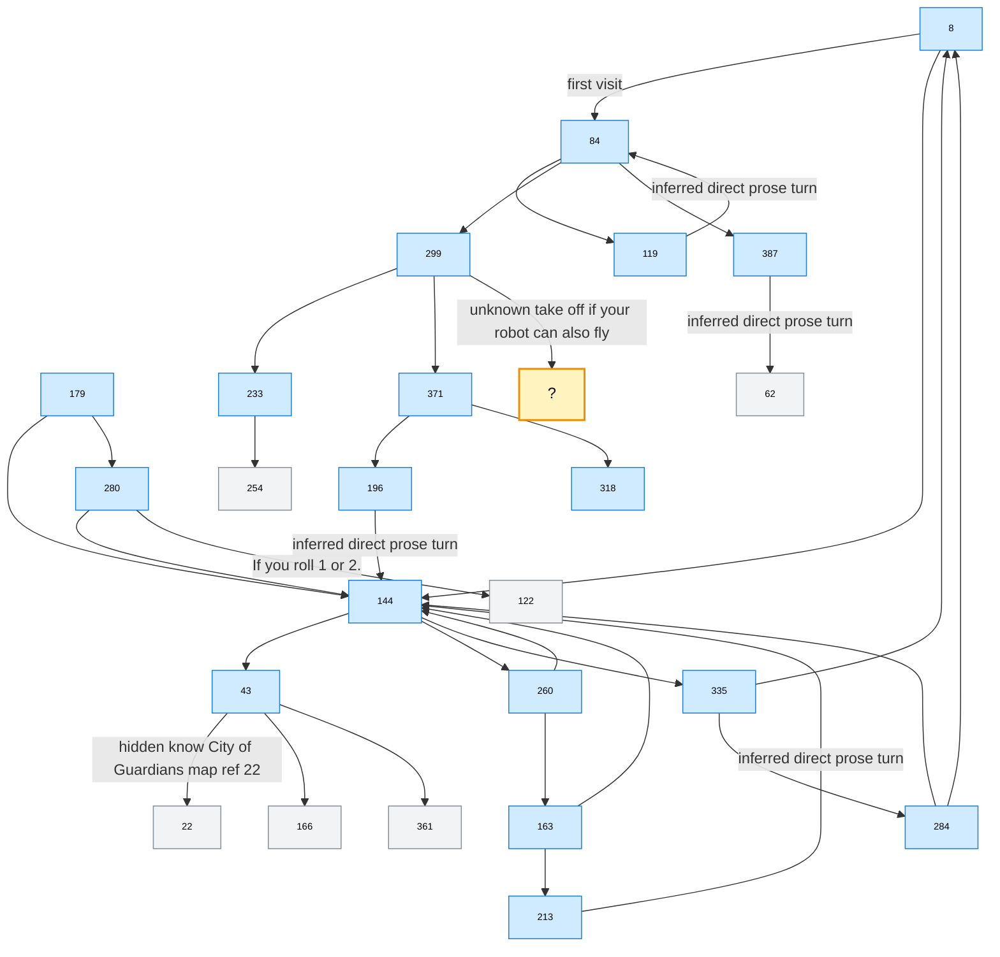

## City of Worship

- Blocks: 8. Internal edges: 11. External edges: 7. Unresolved edges: 0.
- Exits to: Capital City (4), City of Industry (1), City of Knowledge (1), City of Storms (1).

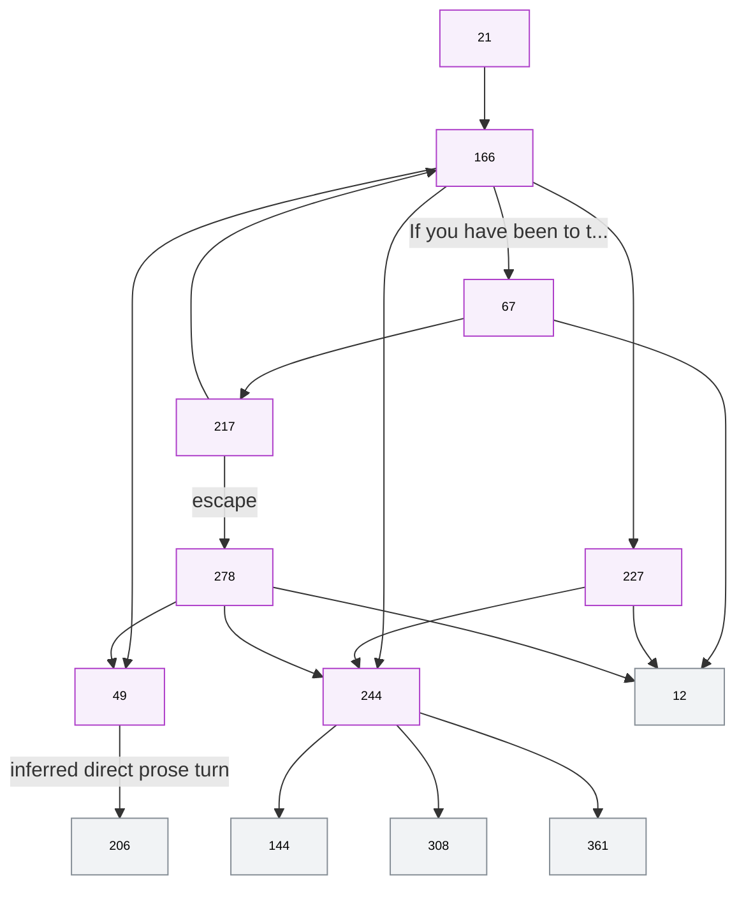

## City of Pleasure

- Blocks: 12. Internal edges: 19. External edges: 3. Unresolved edges: 0.
- Exits to: City of Industry (1), City of Knowledge (1), City of the Jungle (1).

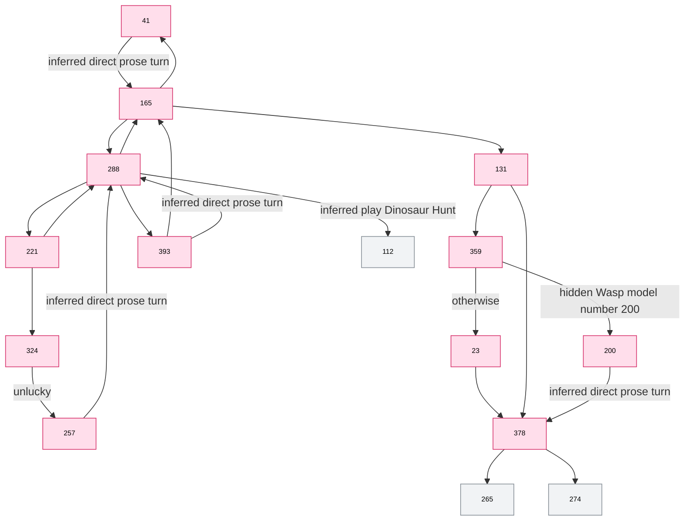

## Inherit

- Blocks: 39. Internal edges: 38. External edges: 20. Unresolved edges: 0.
- Exits to: City of the Jungle (6), City of Knowledge (4), City of the Guardians (4), City of Storms (2), City of Worship (2), Capital City (1), City of Industry (1).

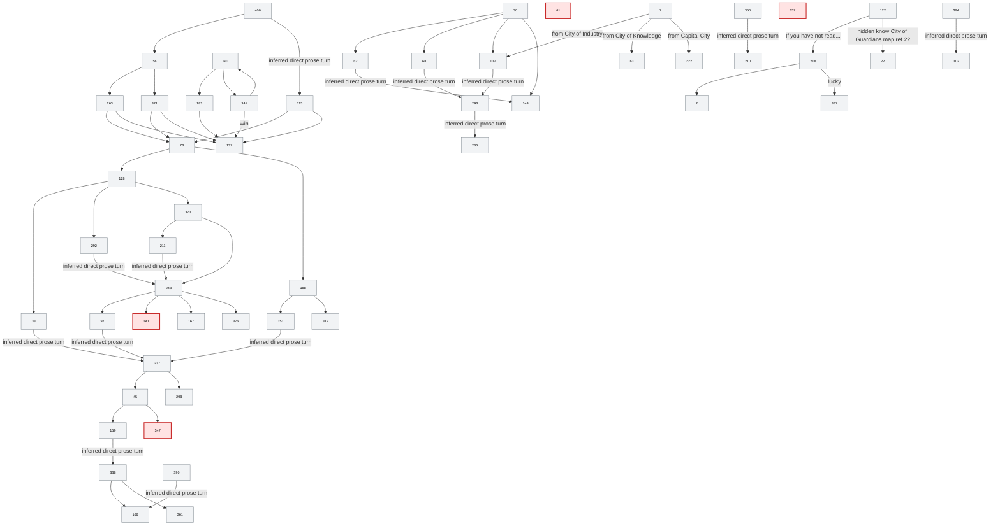

## Unknown

- Blocks: 47. Internal edges: 36. External edges: 34. Unresolved edges: 0.
- Exits to: City of Knowledge (9), Capital City (6), Inherit (5), City of the Jungle (4), City of Storms (3), City of Industry (2), City of the Guardians (2), City of Worship (2), City of Pleasure (1).

```mermaid
flowchart TD
    classDef start fill:#d0ebff,stroke:#1c7ed6,stroke-width:2px,color:#000;
    classDef victory fill:#d8f5d0,stroke:#2b8a3e,stroke-width:3px,color:#000;
    classDef ending fill:#ffe3e3,stroke:#c92a2a,stroke-width:2px,color:#000;
    classDef unknown fill:#fff3bf,stroke:#f08c00,stroke-width:2px,color:#000;
    classDef external fill:#f1f3f5,stroke:#868e96,color:#000,font-size:10px;
    classDef loc_Farm fill:#e3fafc,stroke:#1098ad,color:#000,font-size:10px;
    classDef loc_Current fill:#edf2ff,stroke:#4263eb,color:#000,font-size:10px;
    classDef loc_Capital_City fill:#ffe3e3,stroke:#c92a2a,color:#000,font-size:10px;
    classDef loc_City_of_Knowledge fill:#f3e8ff,stroke:#7b2cbf,color:#000,font-size:10px;
    classDef loc_City_of_Industry fill:#d3f9d8,stroke:#2b8a3e,color:#000,font-size:10px;
    classDef loc_City_of_the_Guardians fill:#e6fcf5,stroke:#0ca678,color:#000,font-size:10px;
    classDef loc_City_of_the_Jungle fill:#fff3bf,stroke:#f08c00,color:#000,font-size:10px;
    classDef loc_City_of_Storms fill:#d0ebff,stroke:#1c7ed6,color:#000,font-size:10px;
    classDef loc_City_of_Worship fill:#f8f0fc,stroke:#ae3ec9,color:#000,font-size:10px;
    classDef loc_City_of_Pleasure fill:#ffdeeb,stroke:#d6336c,color:#000,font-size:10px;
    classDef loc_Inherit fill:#f1f3f5,stroke:#868e96,color:#000,font-size:10px;
    classDef loc_Unknown fill:#fff9db,stroke:#fab005,color:#000,font-size:10px;

    b0028["28"]
    b0051["51"]
    b0079["79"]
    b0081["81"]
    b0094["94"]
    b0099["99"]
    b0100["100"]
    b0101["101"]
    b0118["118"]
    b0121["121"]
    b0130["130"]
    b0135["135"]
    b0140["140"]
    b0143["143"]
    b0152["152"]
    b0169["169"]
    b0172["172"]
    b0181["181"]
    b0191["191"]
    b0197["197"]
    b0203["203"]
    b0220["220"]
    b0236["236"]
    b0238["238"]
    b0246["246"]
    b0250["250"]
    b0262["262"]
    b0271["271"]
    b0272["272"]
    b0279["279"]
    b0281["281"]
    b0287["287"]
    b0294["294"]
    b0316["316"]
    b0319["319"]
    b0320["320"]
    b0331["331"]
    b0344["344"]
    b0346["346"]
    b0351["351"]
    b0362["362"]
    b0363["363"]
    b0364["364"]
    b0379["379"]
    b0382["382"]
    b0385["385"]
    b0389["389"]
    e0003["3"]
    e0007["7"]
    e0009["9"]
    e0012["12"]
    e0030["30"]
    e0044["44"]
    e0062["62"]
    e0064["64"]
    e0088["88"]
    e0137["137"]
    e0144["144"]
    e0150["150"]
    e0166["166"]
    e0192["192"]
    e0225["225"]
    e0247["247"]
    e0288["288"]
    e0293["293"]
    e0308["308"]
    e0318["318"]
    e0322["322"]
    e0333["333"]
    e0376["376"]
    e0396["396"]

    b0081 --> b0099
    b0081 --> b0152
    b0099 -->|lucky| b0130
    b0099 --> b0172
    b0135 --> b0362
    b0143 --> b0363
    b0172 --> b0203
    b0172 --> b0262
    b0181 --> b0028
    b0197 -->|otherwise| b0236
    b0203 -->|inferred direct prose turn| b0281
    b0220 -->|inferred direct prose turn| b0287
    b0236 -->|no password| b0389
    b0246 --> b0101
    b0250 --> b0272
    b0250 --> b0294
    b0262 --> b0203
    b0262 --> b0281
    b0271 -->|inferred direct prose turn| b0143
    b0279 --> b0121
    b0279 -->|lucky| b0191
    b0281 --> b0238
    b0294 --> b0320
    b0294 --> b0344
    b0316 -->|hidden Blue Potion 10 letters| b0100
    b0319 -->|inferred direct prose turn| b0143
    b0331 --> b0279
    b0331 --> b0382
    b0346 --> b0287
    b0351 --> b0246
    b0362 -->|inferred direct prose turn| b0169
    b0363 --> b0220
    b0363 -->|If you have taken the...| b0346
    b0385 --> b0271
    b0385 -->|If you have a robot.| b0319
    b0389 -->|inferred direct prose turn| b0169
    b0079 -->|inferred direct prose turn| e0288
    b0094 -->|inferred direct prose turn| e0044
    b0100 -->|inferred direct prose turn| e0166
    b0101 --> e0062
    b0101 -->|inferred direct prose turn| e0144
    b0118 -->|inferred direct prose turn| e0333
    b0130 -->|inferred direct prose turn| e0192
    b0135 --> e0293
    b0152 -->|inferred direct prose turn| e0192
    b0169 --> e0247
    b0169 --> e0376
    b0172 --> e0088
    b0181 --> e0318
    b0191 --> e0064
    b0191 -->|If you have not alrea...| e0225
    b0197 -->|hidden recall password 88| e0088
    b0220 --> e0030
    b0236 -->|hidden know countersign 'Seven'| e0007
    b0238 -->|inferred direct prose turn| e0308
    b0272 -->|inferred direct prose turn| e0396
    b0281 -->|escape| e0030
    b0281 --> e0192
    b0316 -->|hidden Lavender Potion 15 letters| e0150
    b0316 -->|If you have no flask.| e0166
    b0320 -->|inferred direct prose turn| e0396
    b0344 -->|inferred direct prose turn| e0396
    b0346 --> e0003
    b0346 --> e0308
    b0346 -->|If you have read the...| e0322
    b0351 --> e0144
    b0364 -->|inferred direct prose turn| e0009
    b0379 -->|inferred direct prose turn| e0012
    b0382 --> e0137
    b0382 -->|If you have not alrea...| e0225

    class b0028,b0051,b0079,b0081,b0094,b0099,b0100,b0101,b0118,b0121,b0130,b0135,b0140,b0143,b0152,b0169,b0172,b0181,b0191,b0197,b0203,b0220,b0236,b0238,b0246,b0250,b0262,b0271,b0272,b0279,b0281,b0287,b0294,b0316,b0319,b0320,b0331,b0344,b0346,b0351,b0362,b0363,b0364,b0379,b0382,b0385,b0389 loc_Unknown;
    class e0003,e0007,e0009,e0012,e0030,e0044,e0062,e0064,e0088,e0137,e0144,e0150,e0166,e0192,e0225,e0247,e0288,e0293,e0308,e0318,e0322,e0333,e0376,e0396 external;
    class b0140 victory;
    class b0051,b0121,b0287 ending;
```

## Unresolved Edges

- `92 -> ?` after defeating the Construction Robot.
- `270 -> ?` after fleeing the jungle with enough ARMOUR left.
- `299 -> ?` for the flying take-off option during the Brontosaurus stampede.
- `342 -> ?` if you ignore the Robot Repair shop.
- `356 -> ?` for the left branch at the jungle fork.
